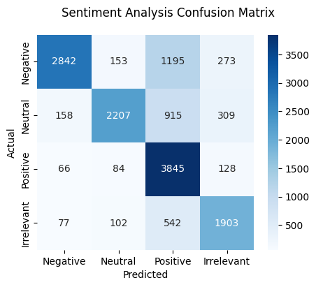

# Twitter sentiment analysis
---

## Contents
- [Introduction](#introduction)
- [ML techniques](#ml-techniques)
- [Results](#results)
- [Prerequisites](#prerequisites)
- [Usage](#usage)
---

## Introduction
This project aims to classify the sentiment of tweets from the dataset ["Twitter Sentiment Analysis"](https://www.kaggle.com/datasets/jp797498e/twitter-entity-sentiment-analysis). This is done by utilizing Google's [Universal Sentence Encoder](https://static.googleusercontent.com/media/research.google.com/en//pubs/archive/46808.pdf) that encodes the tweets into an embedding vector that is fed into a fully connected feed forward neural network. 

---

## ML-Techniques
The network architecture is a simple feed forward network with two hidden layer. There are 512 input neurons, 256 neurons in the first hidden layer and 128 in the second hidden layer. ReLU is used as activation function between each layer. The output layer has 4 neuron representing the 4 different classes: "Positive", "Neutral", "Negative" and "Irrelevant".

---

## Results
The picture shows the confusion matrix of the trained neural network. The network shows relativley good result and classifies most of the entries correctly, though it confuses a fair bit of tweets with negative sentiment with positive sentiment.

Classification rapport:

|               |   precision   |   recall  |   f1-score    |   support |
|---------------|---------------|-----------|---------------|-----------|
|   Negative    |   0.90        |   0.64    |   0.75        |   4463    |
|   Neutral     |   0.87        |   0.61    |   0.72        |   3589    |
|   Positive    |   0.59        |   0.93    |   0.72        |   4123    |
|   Irrelevant  |   0.73        |   0.73    |   0.73        |   2624    |
|---------------|---------------|-----------|---------------|-----------|
|   accuracy    |   ---         |   ---     |   0.73        |   14799   |
|   macro avg   |   0.77        |   0.73    |   0.73        |   14799   |
|   weighted avg|   0.78        |   0.73    |   0.73        |   14799   |
---

## Prerequisites

---

## Usage

